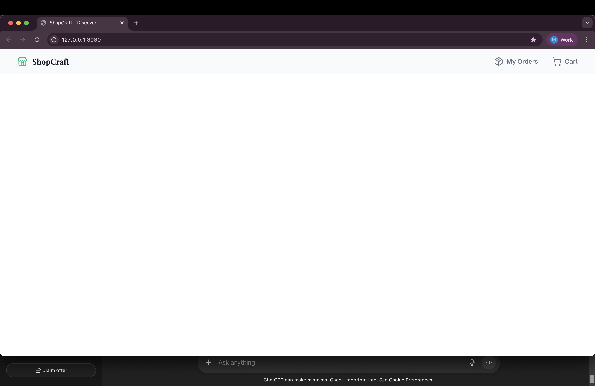

# ShopCraft – E-Commerce Web App (Vanilla JS + SCSS)

A modern clothing e-commerce web application built using:

- HTML5
- SCSS
- Vanilla JavaScript (ES6 Modules)

---

## ✅ Phase 1 – Completed

Project foundation setup:

✔ Project folder structure  
✔ SCSS architecture (7-1 style structure)  
✔ Desktop-first styling approach  
✔ Google Fonts integration (Inter + Playfair Display)  
✔ Base layout system  
✔ Entry HTML shell (`#app` mounting point)  
✔ ES6 module setup (`type="module"`)  
✔ Main JS entry file  
✔ Compiled SCSS → `main.css`

---

## ✅ Phase 2a – UI Development (In Progress)

✔ Responsive Header completed  
✔ BEM naming convention applied  
✔ Green ShopCraft logo (Lucide icons)  
✔ Navigation layout structured  
✔ Modular SCSS component styling

---

## 📸 Preview

---
