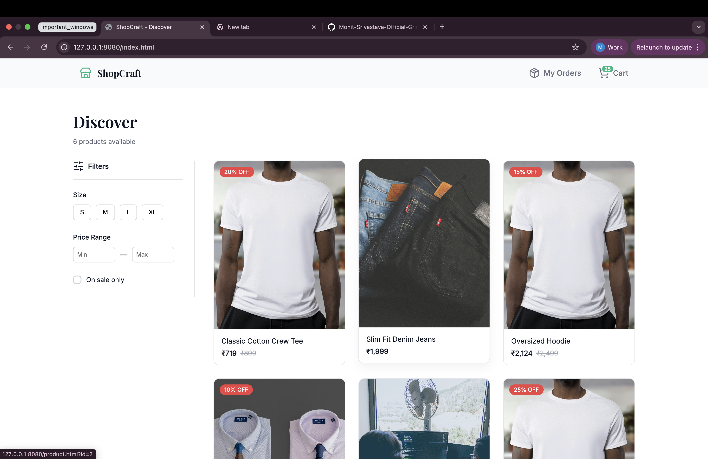
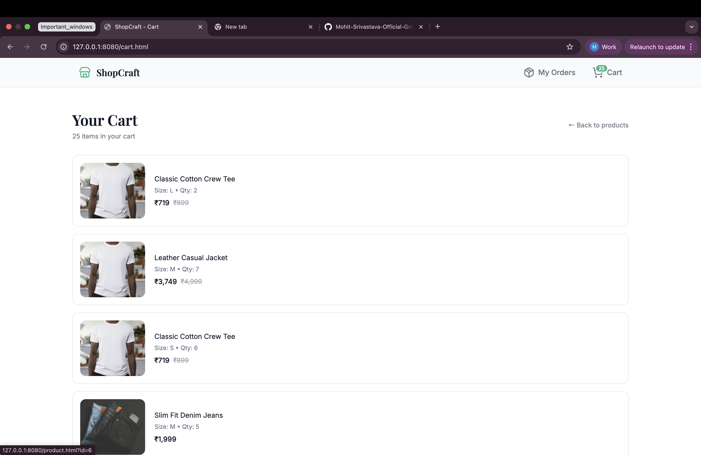
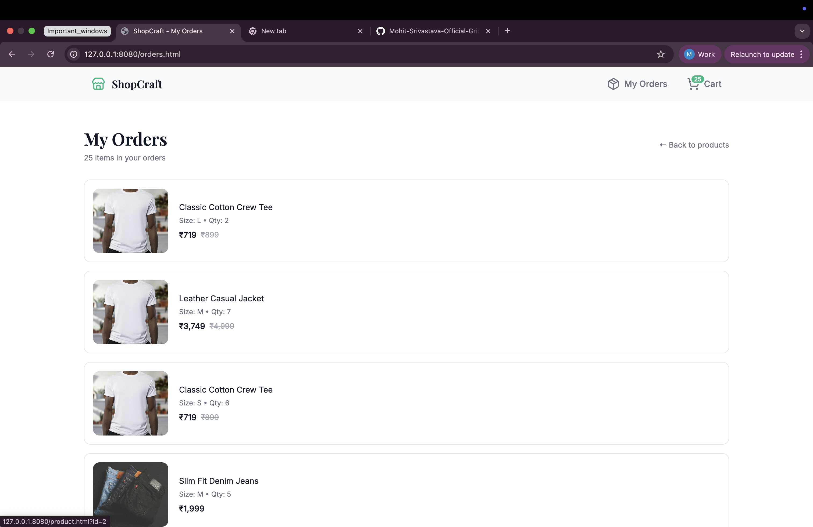
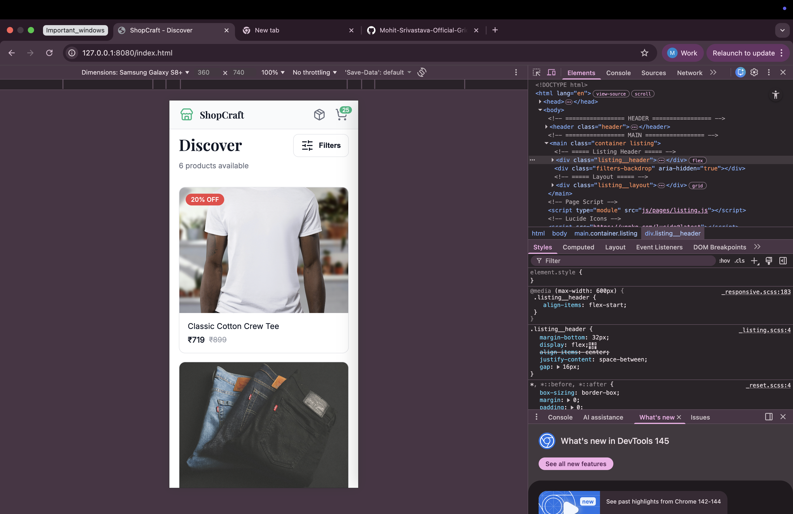
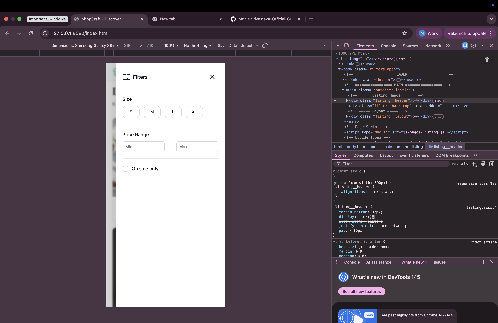
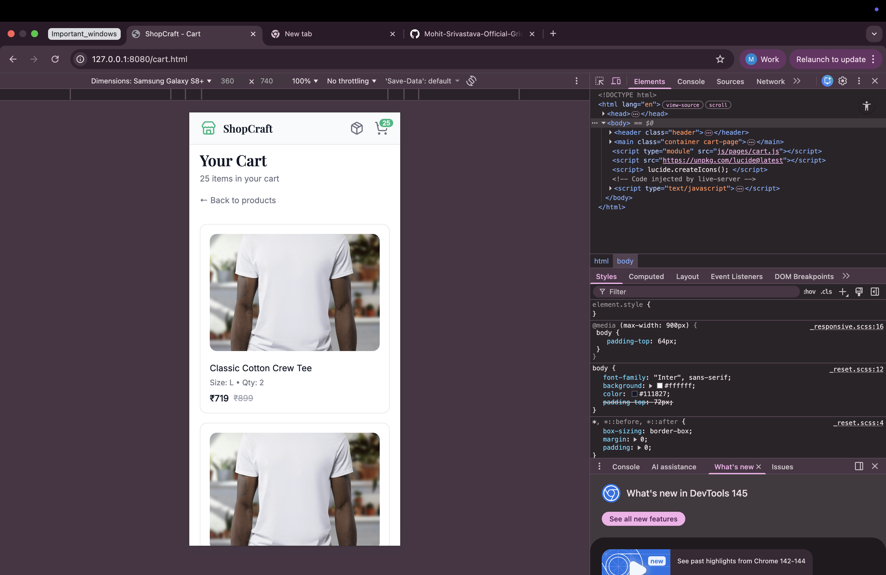
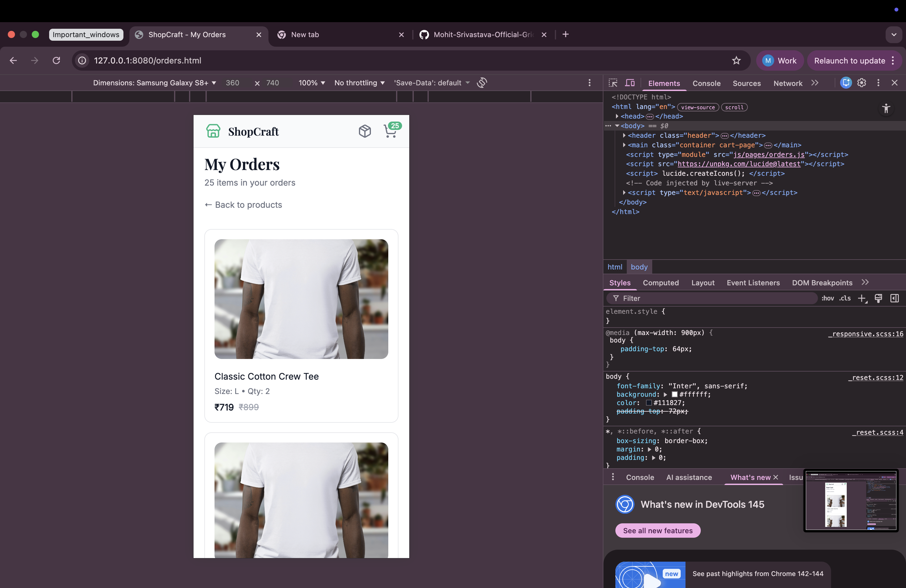

# ShopCraft — E-Commerce Web App (Vanilla JS + SCSS)

ShopCraft is a lightweight, front‑end e‑commerce experience built with **plain HTML, SCSS, and vanilla JavaScript**. It uses a static JSON file as a mock API and LocalStorage for cart persistence, mirroring real‑world app structure without any backend.

---

**Screenshots**

Listing (Desktop)



Cart (Desktop)



Orders (Desktop)



Listing (Mobile)



Filters Drawer (Mobile)



Cart (Mobile)



Orders (Mobile)



---

**Features**

- Product listing with discount badges and price formatting
- Dynamic filters (size, price range, sale only)
- Product details page with size selection and discount banner
- Add to cart using LocalStorage
- Cart + Orders pages reuse the same product card UI
- Toast success message on add‑to‑cart
- Fully responsive layout with mobile filter drawer

---

**Tech Stack**

- HTML5
- SCSS (compiled to CSS)
- Vanilla JavaScript (ES Modules)
- LocalStorage for persistence
- Static JSON as a mock API
- Lucide icons via CDN

---

**How to Run (from `package.json`)**

1. Install dependencies

```bash
npm install
```

2. Start the local dev server

```bash
npm run dev
```

This uses `live-server` and will open the app in your browser. If it doesn’t, open:

- `http://127.0.0.1:8080/index.html`

3. (Optional) Watch and compile SCSS

```bash
npm run sass
```

---

**Project Structure**

- `index.html` — Product listing page
- `product.html` — Product detail page
- `cart.html` — Cart page
- `orders.html` — Orders page
- `data/products.json` — Mock product data
- `js/pages/` — Page controllers (listing, product, cart, orders)
- `js/components/` — Reusable UI helpers (product card, toast, filters, badge)
- `js/services/` — Business logic (cart + product services)
- `js/utils/` — Storage + formatting helpers
- `styles/` — SCSS partials and compiled CSS

---
